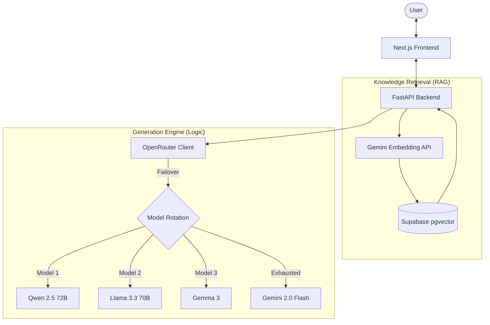

# AI Learning Assistant (Elite Edition)

An advanced, robust AI-powered learning platform that transforms complex PDFs and YouTube videos into structured knowledge. This version features a **Multi-LLM Fallback Architecture** designed to bypass free-tier rate limits and ensure maximum uptime.

## 🚀 Key Improvements (Internship Assignment)

- **SDK Migration**: Fully migrated from legacy `google-generativeai` to the modern `google-genai` SDK.
- **OpenRouter Integration**: Integrated OpenRouter as the primary content generation provider to access high-speed free models (Llama 3.3, Qwen 2.5, etc.).
- **Multi-Model Rotation**: Autonomous fallback system that rotates through multiple free models if an upstream provider is busy.
- **Hybrid LLM Strategy**: 
  - **Gemini**: Primary for document embeddings (optimized for RAG) and final generator fallback.
  - **OpenRouter**: Primary for interactive Chat, Quiz, and Flashcard generation.
- **Robust Error Handling**: Centralized exponential backoff and graceful initialization for Supabase and LLM clients.

## 🛠️ Tech Stack

| Layer | Technology |
|---|---|
| **Frontend** | Next.js 14+ (App Router), TailwindCSS, shadcn/ui |
| **Backend** | Python FastAPI |
| **Database** | Supabase (PostgreSQL) + pgvector |
| **Primary LLMs** | OpenRouter (Llama 3.3 70B, Qwen 2.5 72B), Gemini 2.0 Flash |
| **Embeddings** | Gemini `gemini-embedding-001` (Custom Paced for Free Tier) |

## ✨ Features

- **📺 YouTube Mastery**: Fetches transcripts, chunks content with sliding windows, and stores vectorized knowledge.
- **📄 PDF Intelligence**: Extracts text via PyMuPDF with layout-aware chunking.
- **🗂️ Smart Flashcards**: Generates comprehensive Q&A cards with a premium 3D flip interface.
- **🧠 Adaptive Quizzes**: MCQ generation with instant feedback and pedagogical explanations.
- **💬 Streaming RAG Chat**: Real-time interactive chat grounded in your documents with SSE streaming.
- **🔄 Smart Fallback**: Automatically switches models in < 1s if a rate limit is detected.

## 🏗️ Architecture



## ⚙️ Setup

### Prerequisites
- Node.js 18+ & Python 3.10+
- [Supabase Project](https://supabase.com)
- [Gemini API Key](https://aistudio.google.com)
- [OpenRouter API Key](https://openrouter.ai) (Recommended for stability)

### 1. Database Initialization
Execute the [`supabase_setup.sql`](./supabase_setup.sql) script in your Supabase SQL Editor. This sets up the `vector` extensions, tables, and the `match_chunks` RPC.

### 2. Backend Configuration
```bash
cd server
python -m venv venv
source venv/bin/activate # Windows: .\venv\Scripts\activate
pip install -r requirements.txt
cp .env.example .env
```
Fill in your `.env` with:
- `GEMINI_API_KEY`
- `SUPABASE_URL` & `SUPABASE_SERVICE_KEY`
- `OPENROUTER_API_KEY` (Optional but highly recommended)

### 3. Run the App
- **Backend (Local)**: `cd server && python main.py`
- **Frontend (Local)**: `cd client && npm run dev`

## 🚀 Deployment (Vercel)

This project is configured as a monorepo for seamless deployment on Vercel.

### Backend (Python FastAPI)
The server uses the `api/index.py` convention for Vercel's Python runtime. 
1. Connect your GitHub repository to Vercel.
2. Vercel will automatically detect the configuration in `vercel.json`.
3. Add the environment variables from `server/.env.example` to your Vercel Project Settings.

### Frontend (Next.js)
The frontend in `client/` can be deployed as a standard Next.js project. If deploying separately, ensure you update the `NEXT_PUBLIC_API_URL` to point to your Vercel backend URL.

## 📂 Project Structure

- `client/`: NextJS 14 frontend with Zustand state management.
- `server/`:
    - `routers/`: Modular API endpoints (Chat, Flashcards, Quiz).
    - `utils/`: 
        - `embeddings.py`: Smart-pacing for free-tier embeddings.
        - `error_helpers.py`: Centralized retry and LLM rotation logic.
        - `supabase_ops.py`: Clean abstraction for pgvector operations.
- `supabase_setup.sql`: Database schema and RAG functions.

---
*Built for the AI Learning Assistant internship assignment.*
